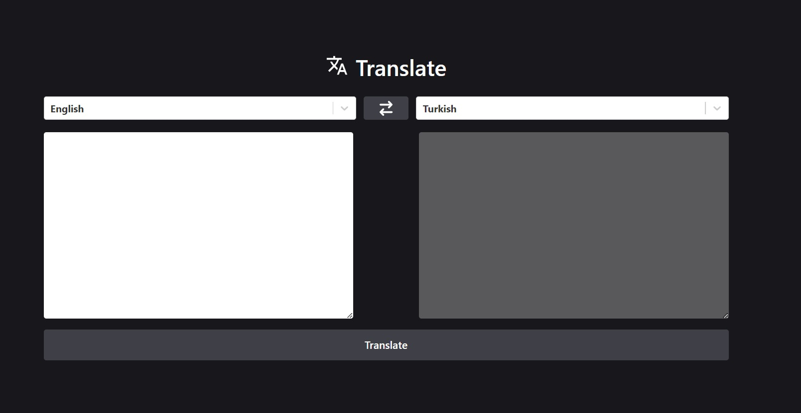

# React_TranslateApp_Toolkit

The Translate App, built using React, Redux Toolkit, and Thunk, offers users translation options in many languages. It uses React Redux for state management, Axios for HTTP requests, React Select for user-friendly dropdowns, and Tailwind CSS for styling.

# Tools and Libraries Used

-react-redux,
-@reduxjs/toolkit,
-react-select
-axios
-tailwind

# Screenshots

## Gif

